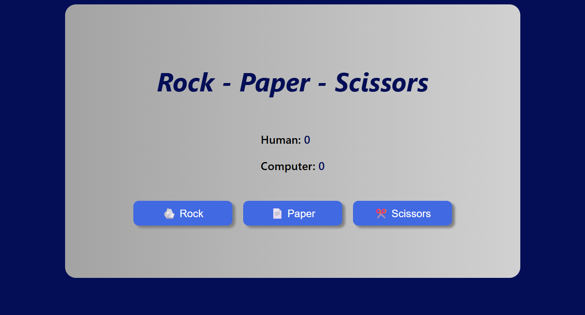

<h1>Pedra - Papel - Tesoura</h1>

<h2>Descrição</h2>

No jogo pedra,papel e tesoura,
o jogador escolhe (pedra,papel ou tesoura) atráves de três botões.Essa escolha é comparada com a escolha gerada aleatóriamente pelo computador.
Será retornado como resultado empate,vitoria ou derrota, a cada vitoria e somado 1 ponto.Ganha o jogo quem somar 5 pontos primeiro.

<h2>Tecnologias</h2>

 

 

<h2>Demonstração</h2>
https://orlandoseven.github.io/javascript-pedra_papel-_tesoura/
